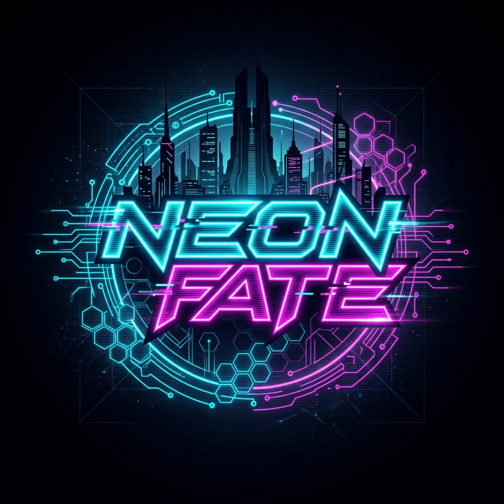
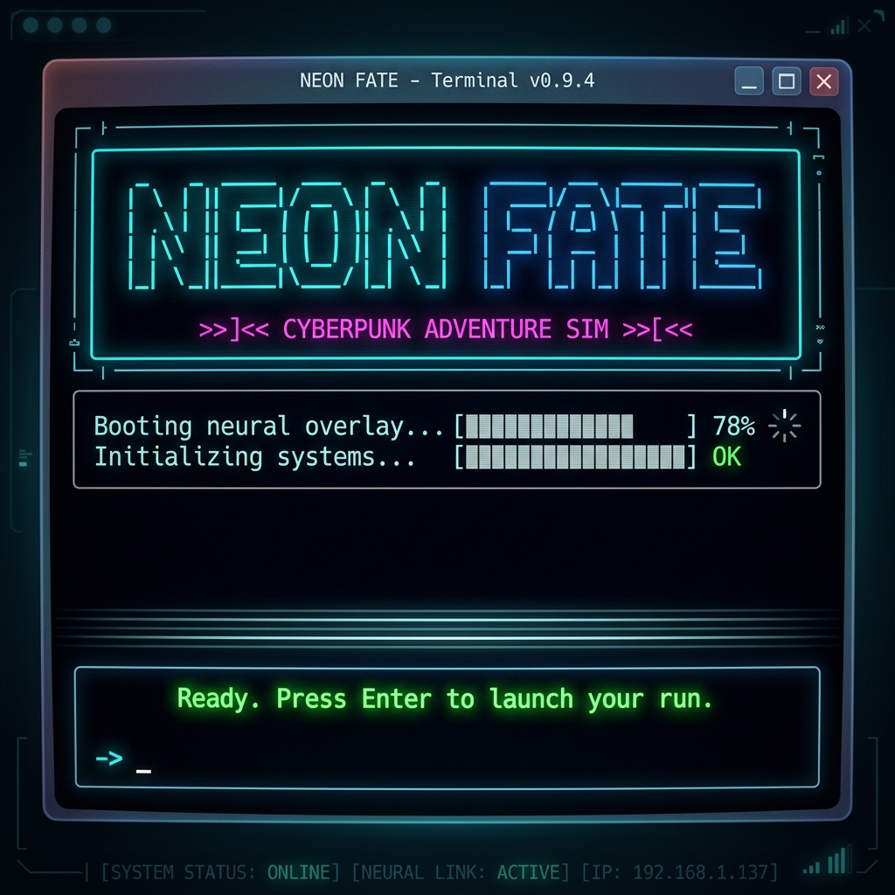
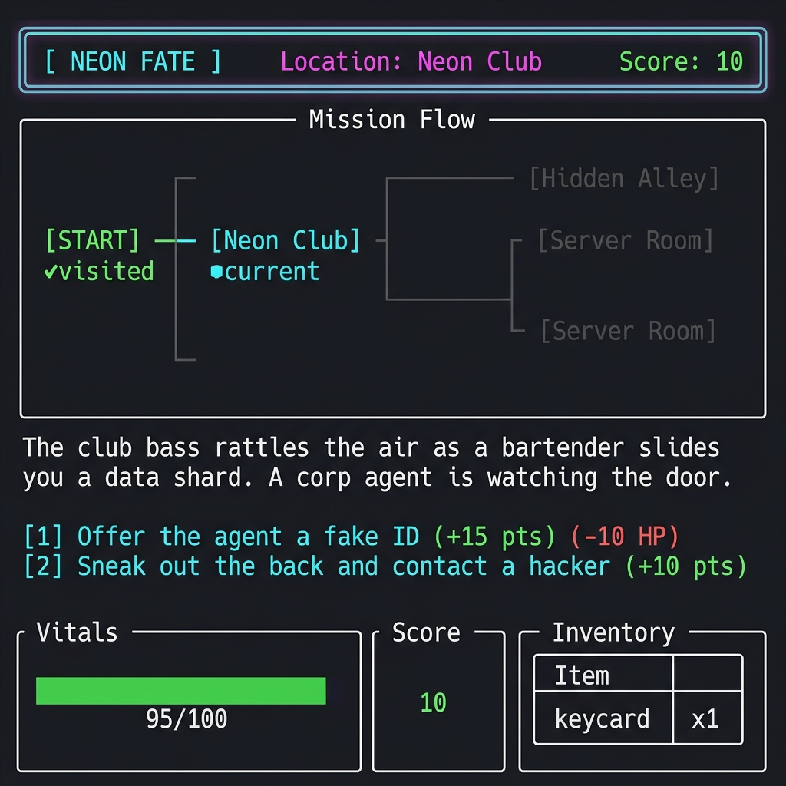
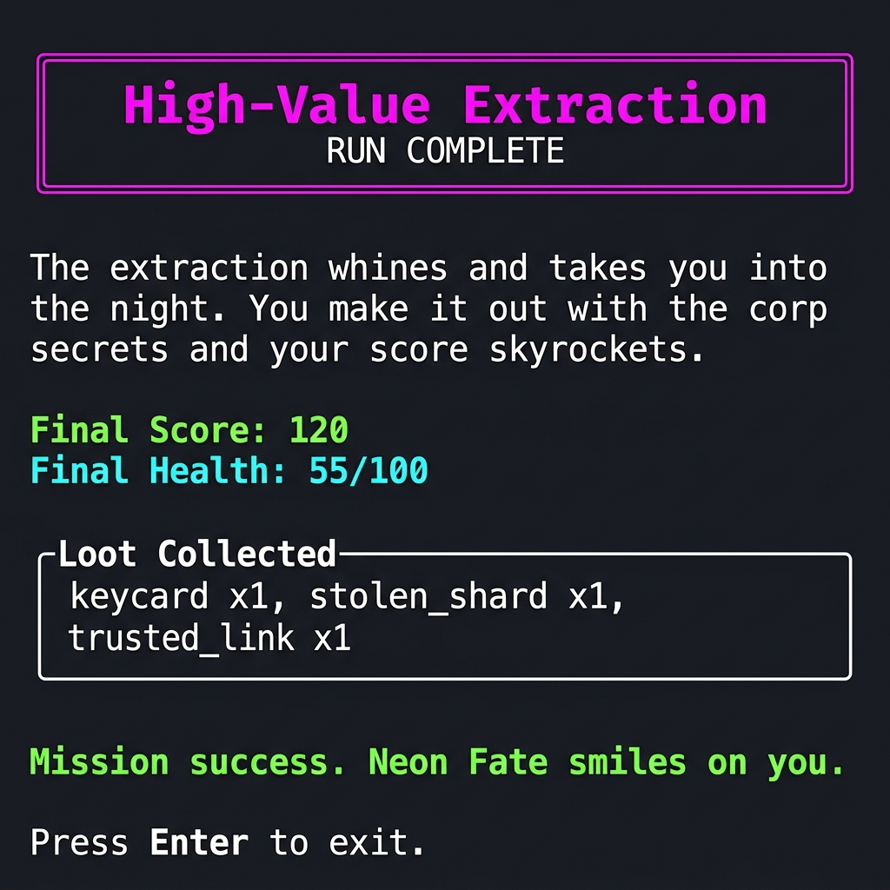
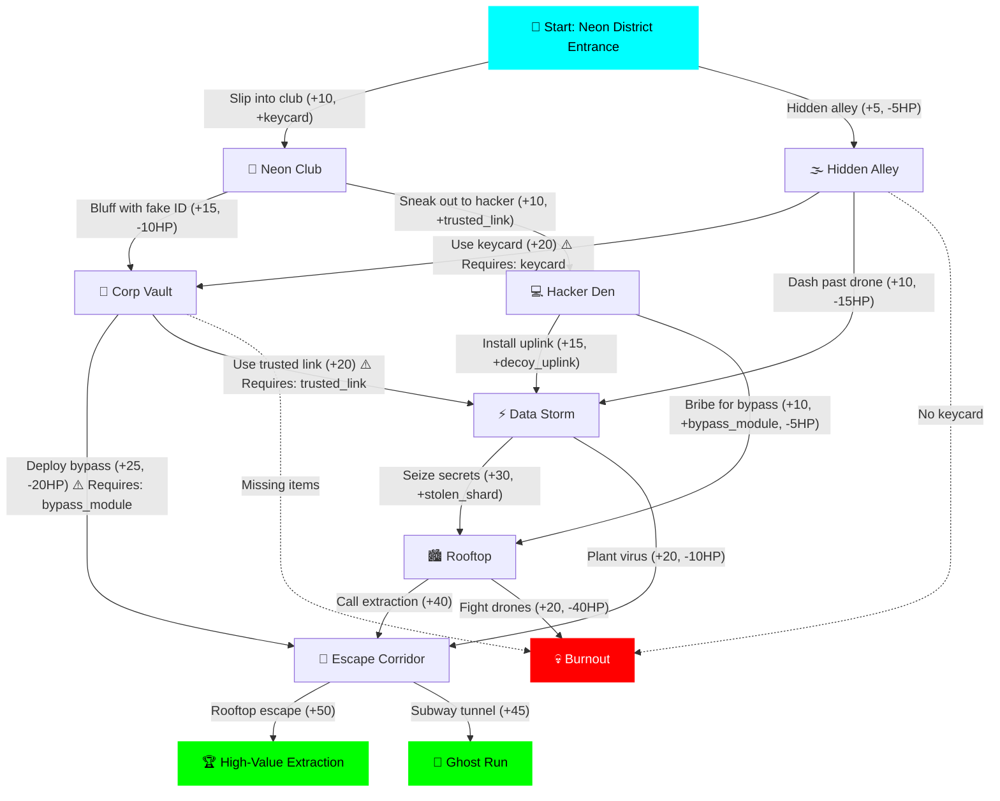

<p align="center">
  
</p>

<h1 align="center">⚡ NEON FATE — Cyberpunk Adventure Sim ⚡</h1>

<p align="center">
  <em>A terminal-based, choice-driven cyberpunk adventure game built entirely with GitHub Copilot.</em>
</p>

<p align="center">
  
  
  
  
</p>

---

## 📖 Table of Contents

- [Overview](#-overview)
- [Features](#-features)
- [Screenshots](#-screenshots)
- [Architecture](#-architecture)
- [Getting Started](#-getting-started)
  - [Prerequisites](#prerequisites)
  - [Installation](#installation)
  - [Running the Game](#running-the-game)
- [Project Structure](#-project-structure)
- [Module Deep-Dive](#-module-deep-dive)
  - [Game Engine](#-game-engine---gameenginepy)
  - [Player System](#-player-system---playerpy)
  - [Story Nodes](#-story-nodes---nodespy)
  - [UI Renderer](#-ui-renderer---displaypy)
  - [Flowchart Visualizer](#-flowchart-visualizer---flowchartpy)
- [Story Map](#-story-map)
- [Extending the Game](#-extending-the-game)
  - [Adding New Story Nodes](#adding-new-story-nodes)
  - [Customizing the UI](#customizing-the-ui)
- [Dependencies](#-dependencies)
- [Contributing](#-contributing)
- [License](#-license)

---

## 🌆 Overview

**Neon Fate** is an immersive, terminal-based text adventure game set in a cyberpunk dystopia. You play as a **Runner** — a digital mercenary navigating neon-lit streets, hacking corporate vaults, and making split-second decisions that determine your fate.

Every choice matters. Gain items, manage your health, accumulate score, and navigate through a branching narrative with **multiple endings** — from a glorious high-value extraction to a devastating system burnout.

> **Built entirely using GitHub Copilot** as part of a skills demonstration, showcasing AI-assisted software development from architecture to polished product.

---

## ✨ Features

| Feature | Description |
|---|---|
| 🎮 **Branching Narrative** | 10 unique story nodes with multiple paths and 3 distinct endings |
| ❤️ **Health System** | Dynamic health tracking with damage, healing, and burnout mechanics |
| 🎒 **Inventory Management** | Collect, use, and lose items that gate specific story paths |
| 📊 **Score Tracking** | Every choice awards points — compete for the highest score |
| 🗺️ **Live Flowchart** | Real-time mission progress visualizer showing visited/current nodes |
| 🎨 **Rich Terminal UI** | Styled panels, health bars, inventory tables, and ASCII art title |
| 🔒 **Gated Choices** | Some paths require specific items — plan your route carefully |
| 🔄 **Replayability** | Multiple endings and branching paths encourage replaying |

---

## 🖼️ Screenshots

### 🚀 Intro Screen
The game boots with a cinematic ASCII art title and a neural overlay loading animation.

<p align="center">
  
</p>

### 🎮 Gameplay Scene
Each scene displays a location header, mission flowchart, narrative description, available choices (with score/health indicators), a vitals health bar, and your inventory.

<p align="center">
  
</p>

### 🏆 Ending Screen
Upon completing your run, the game presents your final score, health, collected loot, and whether you succeeded or failed the mission.

<p align="center">
  
</p>

---

## 🏗️ Architecture

The game follows a clean **MVC-inspired architecture**, separating concerns into three distinct packages:

```
┌─────────────────────────────────────────────────────────┐
│                        main.py                          │
│              (Entry Point & Orchestrator)                │
└──────────┬──────────────┬──────────────┬────────────────┘
           │              │              │
     ┌─────▼─────┐  ┌────▼────┐  ┌──────▼──────┐
     │   game/    │  │  story/ │  │    ui/       │
     │  (Logic)   │  │ (Data)  │  │ (Rendering)  │
     │            │  │         │  │              │
     │ engine.py  │  │nodes.py │  │ display.py   │
     │ player.py  │  │         │  │ flowchart.py │
     └───────────┘  └─────────┘  └──────────────┘

     Engine drives    Declarative    Rich terminal
     game loop &      story graph    rendering with
     state mgmt       (10 nodes)     panels & bars
```

---

## 🚀 Getting Started

### Prerequisites

- **Python 3.10+** — [Download here](https://www.python.org/downloads/)
- **pip** — Comes bundled with Python
- A terminal that supports **ANSI colors** (Windows Terminal, iTerm2, any modern Linux terminal)

### Installation

1. **Clone the repository**

   ```bash
   git clone https://github.com/pratyush06-aec/copilot_skills.git
   cd copilot_skills
   ```

2. **Create a virtual environment** *(recommended)*

   ```bash
   python -m venv venv

   # On Windows
   venv\Scripts\activate

   # On macOS/Linux
   source venv/bin/activate
   ```

3. **Install dependencies**

   ```bash
   pip install -r adventure_game/requirements.txt
   ```

### Running the Game

```bash
cd adventure_game
python main.py
```

> 💡 **Tip:** Use **Windows Terminal** or **VS Code's integrated terminal** for the best visual experience with Rich's styled output.

---

## 📁 Project Structure

```
copilot_skills/
│
├── assets/                      # Project assets (logo, screenshots)
│   ├── logo.png                 # Project logo
│   ├── intro_screen.png         # Intro screen screenshot
│   ├── gameplay_scene.png       # Gameplay screenshot
│   └── ending_screen.png        # Ending screen screenshot
│
├── adventure_game/              # Main game package
│   ├── main.py                  # 🚀 Entry point — initializes and runs the game
│   ├── requirements.txt         # Python dependencies
│   │
│   ├── game/                    # 🎮 Game logic layer
│   │   ├── __init__.py
│   │   ├── engine.py            # Core game loop, state machine, choice execution
│   │   └── player.py            # Player model (health, inventory, score)
│   │
│   ├── story/                   # 📜 Story data layer
│   │   ├── __init__.py
│   │   └── nodes.py             # Declarative story graph (10 nodes, 3 endings)
│   │
│   └── ui/                      # 🎨 Presentation layer
│       ├── __init__.py
│       ├── display.py           # Rich-powered terminal renderer
│       └── flowchart.py         # ASCII flowchart progress visualizer
│
├── .gitattributes               # Git line-ending normalization
└── README.md                    # 📖 This file
```

---

## 🔍 Module Deep-Dive

### 🎮 Game Engine — `engine.py`

The `GameEngine` class is the heart of the application. It implements a **state-machine game loop** that:

1. Renders the current story node
2. Prompts the player for a choice
3. Validates item requirements (gated paths)
4. Applies score/health/inventory changes
5. Transitions to the next node
6. Checks for endings or health-based game overs

```python
class GameEngine:
    def __init__(self, renderer, story_nodes):
        self.current_node_id = "start"      # State machine cursor
        self.player = Player()               # Player state
        self.visited_nodes = []              # Tracking for flowchart
        self.node_map = NODE_MAP             # O(1) node lookup

    def run(self):
        """Main game loop — runs until an ending node or health depletion."""

    def execute_choice(self, node, choice_index):
        """Processes a choice: checks requirements, applies effects, transitions."""
```

**Key Design Decisions:**
- Uses a **dictionary-based node map** (`NODE_MAP`) for O(1) node lookups instead of list iteration
- Separates **rendering** from **logic** — the engine never directly prints to the console
- Handles **item-gated choices** with optional fallback nodes

---

### 👤 Player System — `player.py`

The `Player` class encapsulates all player state:

| Attribute | Type | Description |
|---|---|---|
| `name` | `str` | Player name (default: "Runner") |
| `health` | `int` | Current health (0–100) |
| `max_health` | `int` | Maximum health cap (100) |
| `inventory` | `Dict[str, int]` | Item name → count mapping |
| `score` | `int` | Accumulated score |

**Methods:**

```python
player.add_item("keycard")          # Add item to inventory
player.remove_item("keycard")       # Remove item (returns False if not found)
player.has_item("keycard")          # Check if item exists
player.take_damage(15)              # Reduce health (clamped to 0)
player.heal(20)                     # Restore health (clamped to max)
player.add_score(50)                # Increment score
player.get_status()                 # Returns full status dict
player.inventory_lines()            # Formatted inventory for display
```

---

### 📜 Story Nodes — `nodes.py`

The story is defined as a **declarative graph** using a list of `Node` dictionaries. Each node contains:

```python
{
    "id": "neon_club",                                           # Unique identifier
    "title": "Neon Club",                                        # Display name
    "description": "The club bass rattles the air...",           # Narrative text
    "choices": [
        {
            "text": "Offer the agent a fake ID...",              # Choice label
            "next": "corp_vault",                                # Target node ID
            "score": 15,                                         # Points awarded
            "health": -10,                                       # HP change (optional)
            "items": ["keycard"],                                # Items awarded (optional)
            "required_item": "bypass_module",                    # Gate requirement (optional)
            "fallback": "burnout",                               # Fallback if requirement fails
            "remove_items": ["keycard"],                          # Items consumed (optional)
        }
    ],
    "is_ending": False,                                          # Is this a terminal node?
    "ending_type": "win" | "loss",                               # Only on ending nodes
}
```

---

### 🎨 UI Renderer — `display.py`

The `UIRenderer` class handles all terminal output using the **Rich** library:

| Method | Purpose |
|---|---|
| `render_intro()` | ASCII art title + boot animation |
| `render_scene()` | Full scene: header, flowchart, description, choices, status, inventory |
| `render_header()` | Location name, game title, and score |
| `render_flow()` | Mission progress flowchart |
| `render_body()` | Scene description + numbered choices with stat indicators |
| `render_status()` | Health bar (color-coded) + score panel |
| `render_inventory()` | Styled inventory table |
| `render_ending()` | Final score, health, loot summary, and win/loss message |
| `render_requirement_failure()` | Alert when player lacks a required item |

**Health Bar Color Coding:**
- 🟢 **Green** → Health > 60%
- 🟡 **Yellow** → Health 30–60%
- 🔴 **Red** → Health < 30%

---

### 🗺️ Flowchart Visualizer — `flowchart.py`

The `FlowchartVisualizer` renders a real-time ASCII flowchart showing mission progress:

```
╔═ [START] ═╗          ← Green (visited)
  ║
  ╠═▶ [Neon Club]      ← Cyan (current location)
  ║
  ╠═▶ [Hidden Alley]   ← Dim (not yet visited)
  ║
  ╠═▶ [Hacker Den]     ← Dim
  ...
```

**Color States:**
- `bold bright_cyan` — Current node
- `green` — Previously visited
- `dim` — Unvisited

---

## 🗺️ Story Map

The complete story graph with all branching paths:



**Three possible endings:**
- 🏆 **High-Value Extraction** — Maximum glory, rooftop escape
- 👻 **Ghost Run** — Stealth victory, vanish without a trace
- 💀 **System Burnout** — Health depleted or missing critical items

---

## 🛠️ Extending the Game

### Adding New Story Nodes

1. Open `adventure_game/story/nodes.py`
2. Add a new node dictionary to the `STORY_NODES` list:

```python
{
    "id": "underground_market",
    "title": "Underground Market",
    "description": "Flickering holo-signs advertise illegal neural mods...",
    "choices": [
        {
            "text": "Buy a neural booster.",
            "next": "some_next_node",
            "score": 5,
            "health": 10,
            "items": ["neural_booster"],
        },
        {
            "text": "Steal from the vendor and run.",
            "next": "chase_scene",
            "score": 15,
            "health": -20,
        },
    ],
    "is_ending": False,
}
```

3. Update existing nodes to point to your new node via their `"next"` field
4. *(Optional)* Add the new node to the flowchart in `ui/flowchart.py`:

```python
self.layout = [
    ...
    ("underground_market", "[Underground Market]"),
]
```

### Customizing the UI

- **Change the title font:** Modify `self.figlet = Figlet(font="slant")` in `display.py` to use any [pyfiglet font](http://www.figlet.org/examples.html)
- **Add new panels:** Use `rich.panel.Panel` and `rich.table.Table` in `display.py`
- **Change colors:** Rich supports named colors (`bright_cyan`, `magenta`) and hex codes

---

## 📦 Dependencies

| Package | Version | Purpose |
|---|---|---|
| [rich](https://github.com/Textualize/rich) | Latest | Terminal UI rendering (panels, tables, progress bars, styled text) |
| [pyfiglet](https://github.com/pwaller/pyfiglet) | Latest | ASCII art title text generation |
| [colorama](https://github.com/tartley/colorama) | Latest | Cross-platform ANSI color support (Windows compatibility) |

Install all dependencies:
```bash
pip install -r adventure_game/requirements.txt
```

---

## 🤝 Contributing

Contributions are welcome! Here's how to get started:

1. **Fork** the repository
2. **Create** a feature branch: `git checkout -b feature/new-story-arc`
3. **Commit** your changes: `git commit -m "Add underground market story arc"`
4. **Push** to your branch: `git push origin feature/new-story-arc`
5. **Open** a Pull Request

### Ideas for Contribution
- 🆕 New story branches and endings
- 🎨 Enhanced terminal UI effects
- 💾 Save/load game state
- 🏆 Achievements system
- 🎵 Terminal-based sound effects
- 🧪 Unit tests for game engine

---

## 📄 License

This project is open source and available under the [MIT License](LICENSE).

---

<p align="center">
  <strong>Built with ❤️ and GitHub Copilot</strong><br/>
  <em>"The city pulse hums in your veins. Your run begins now."</em>
</p>
